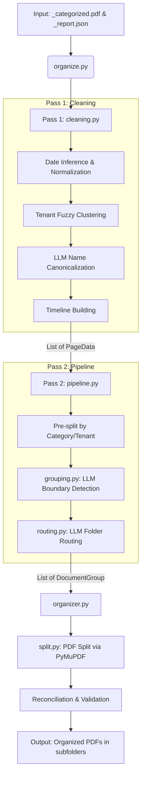

# Codebase Architecture

**Date:** 2026-07-07

## Overview
The `file-organizer` repository is a Python-based pipeline designed to categorize, group, and route scanned or OCR'd housing documents (PDFs). It uses a two-pass architecture leveraging large language models (LLMs) to clean extracted data, identify document boundaries, and intelligently route documents to standard folder structures.

## System Components

1. **CLI Entry Point (`src/organize.py`)**
   - The main orchestrator of the post-processing step.
   - Validates input directories, loads categorized JSON reports, initializes the LLM client, and orchestrates Pass 1 (Cleaning) and Pass 2 (Grouping, Routing, Splitting).

2. **Cleaning & Normalization (`src/cleaning.py`)**
   - Implements **Pass 1** of the pipeline.
   - **Date Parsing:** Normalizes various date formats (Gregorian, Hijri, English, Arabic) into a standard `YYYY-MM-DD` format using heuristics. Infers missing dates based on proximity.
   - **Entity Resolution:** Clusters raw tenant names extracted via OCR using fuzzy matching and an LLM canonicalization pass to form unified identities.
   - **Timeline Construction:** Builds `TenantTimeline` objects defining valid date ranges for each canonical tenant, allowing unassigned pages to be tied to the correct tenant based on date.

3. **Processing Pipeline (`src/processing/`)**
   - Implements **Pass 2** of the pipeline.
   - **Pipeline Orchestrator (`pipeline.py`)**: Wraps grouping and routing.
   - **Grouping (`grouping.py`)**: Batches consecutive pages of the same category and resident, sending them to the LLM to identify logical document boundaries (subject shifts).
   - **Routing (`routing.py`)**: Maps categories to specific folders (e.g., `id_cards` -> `2_personal_details`). Resolves ambiguities (e.g., `letters`) by asking the LLM for the best fit folder.
   - **Organizing & Splitting (`organizer.py`, `split.py`)**: Takes the abstract `DocumentGroup` definitions and physically splits the monolithic input PDF into individual, appropriately named PDF files in the target directory structure using `PyMuPDF` (`fitz`).
   - **Reconciliation:** Validates that the generated PDFs account for every page of the input PDF without missing or duplicating pages inappropriately.

4. **LLM Abstraction (`src/llm/`)**
   - Provides a resilient wrapper around the Google GenAI SDK (`LLMClient`).
   - Handles retries, rate limiting, and structured output parsing (JSON schema).

5. **Core Data Models (`src/core/schemas.py`)**
   - Centralized Pydantic models used to enforce structured output from LLMs and internal boundaries.

## Data Flow

## Key Abstractions

- **`PageData`**: Represents the raw and cleaned metadata for a single physical page (category, raw date, expected tenant, resolved canonical tenant, resolved date).
- **`TenantTimeline`**: Represents the active date bounds (min and max) for a specific canonical tenant, inferred from anchor documents.
- **`DocumentGroup` / `GroupEntry`**: A logical document spanning a start and end page index, representing a contiguous block of pages that share the same subject, tenant, and destination folder.
