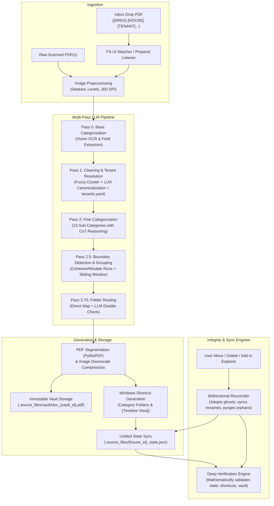
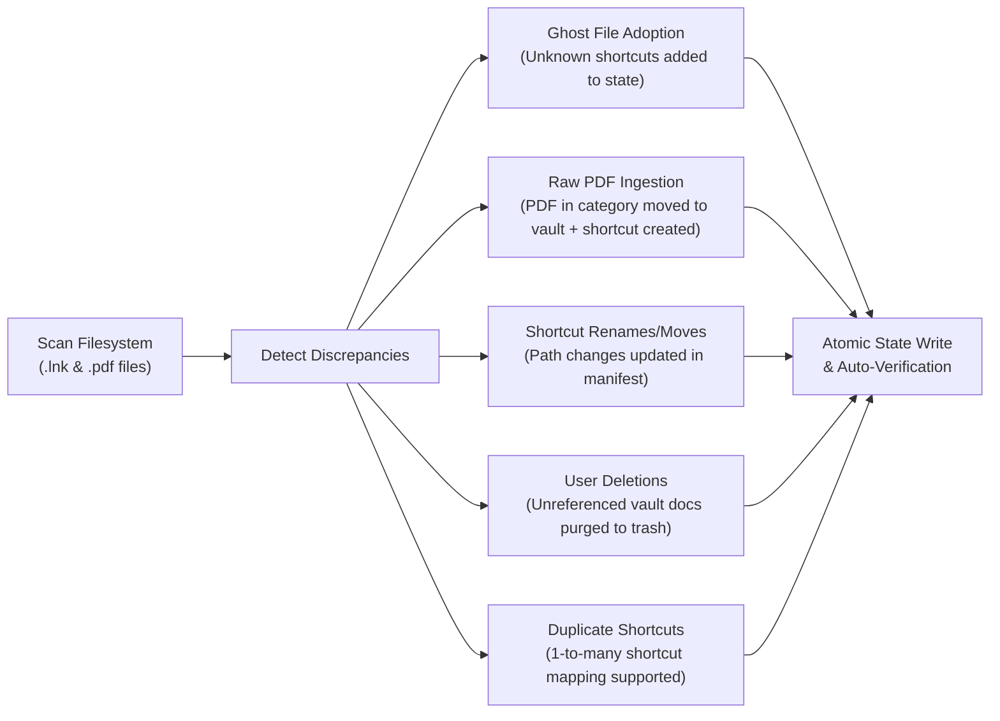

# File Organizer Architecture

## Overview

**File Organizer** is a document intelligence and pipeline system designed to process, classify, segment, and organize multi-page scanned Arabic documents (primarily housing, tenant, and municipal administrative records) into structured filesystem hierarchies.

The system is built around a **Vault-and-Shortcut Architecture** targeting Windows environments (`.lnk` shortcuts), backed by a unified JSON state model, a multi-pass LLM pipeline (utilizing Google Gemini models), and a bidirectional reconciliation engine that treats physical filesystem modifications as first-class user intent.

---

## Architectural Principles

1. **Physical Immutability via Vault Storage (`.source_files/vault/`):**
   Physical document segments are extracted once and stored immutably in `.source_files/vault/doc_{vault_id}.pdf`. User-facing category folders and timeline views contain exclusively lightweight Windows Shortcuts (`.lnk`).
2. **Shortcuts as Virtual Views:**
   Users can freely move, rename, delete, or duplicate shortcuts in File Explorer without corrupting or duplicating underlying PDF binary data.
3. **Unified Single Source of Truth (`state.json`):**
   A single state file (`<house_id>_state.json`) in `.source_files/` tracks every stage of processing: cleaned pages, fine categorization, grouped documents, routed folders, and page-to-file output manifests.
4. **Bidirectional Reconciliation:**
   The filesystem state and the JSON state are kept in mathematical harmony. Manual user adjustments (moving shortcuts, deleting files, dropping raw PDFs into folders) are detected and reconciled back into `state.json`.
5. **Immutable Page Count Auditing:**
   Every input page from the raw ingest must be strictly accounted for in the output manifest. No pages can be silently dropped or duplicated.
6. **Resilient LLM Execution:**
   All generative LLM interactions use strict Pydantic structured output schemas, exponential backoff for rate limits, deterministic fallback routing, and intermediate disk checkpointing.

---

## System Architecture Diagram


```mermaid
flowchart TD
    subgraph Ingestion
        RawPDF["Raw Scanned PDF(s)"] --> ImgPrep["Image Preprocessing\n(Deskew, Levels, 300 DPI)"]
        InboxPDF["Inbox Drop PDF\n([AREA] [HOUSE] [TENANT]...)"] --> Watcher["FS-UI Watcher / Prepend Listener"]
        Watcher --> ImgPrep
    end

    subgraph LLM_Pipeline["Multi-Pass LLM Pipeline"]
        ImgPrep --> Pass0["Pass 0: Base Categorization\n(Vision OCR & Field Extraction)"]
        Pass0 --> Pass1["Pass 1: Cleaning & Tenant Resolution\n(Fuzzy Cluster + LLM Canonicalization + tenants.yaml)"]
        Pass1 --> Pass2["Pass 2: Fine Categorization\n(13 Sub-Categories with CoT Reasoning)"]
        Pass2 --> Pass25["Pass 2.5: Boundary Detection & Grouping\n(Cohesive/Mixable Runs + Sliding Window)"]
        Pass25 --> Pass275["Pass 2.75: Folder Routing\n(Direct Map + LLM Double-Check)"]
    end

    subgraph Output_Generation["Generation & Storage"]
        Pass275 --> Segmenter["PDF Segmentation (PyMuPDF)\n& Image Downscale Compression"]
        Segmenter --> Vault["Immutable Vault Storage\n(.source_files/vault/doc_{vault_id}.pdf)"]
        Segmenter --> LnkGen["Windows Shortcut Generation\n(Category Folders & [Timeline View])"]
        LnkGen --> StateSync["Unified State Sync\n(.source_files/{house_id}_state.json)"]
    end

    subgraph Integrity_and_Sync["Integrity & Sync Engines"]
        StateSync --> Verifier["Deep Verification Engine\n(Mathematically validates state, shortcuts, vault)"]
        ManualMove["User Move / Delete / Add in Explorer"] --> Reconciler["Bidirectional Reconciler\n(Adopts ghosts, syncs renames, purges orphans)"]
        Reconciler --> StateSync
        Reconciler --> Verifier
    end
```

---

## Core Subsystems

### 1. Storage & Filesystem Architecture (Vault & Views)

```
<Area_Folder>/
└── <House_ID> - <Latest_Tenant>/
    ├── 00_Timeline_View/                  # Chronological virtual view (shortcuts)
    │   ├── 001 - 1998-05-12 - عقد إيجار.lnk
    │   └── 003 - 2004-11-01 - طلب صيانة.lnk
    ├── <Tenant_1> ‎(YYYY - YYYY)‎/        # Specific tenant folder (LRM-wrapped dates)
    │   ├── 01_بيانات أساسية/
    │   ├── 02_بيانات شخصية/
    │   │   └── 2001-02-10 - بطاقة هوية.lnk
    │   ├── 05_عقود/
    │   │   └── 1998-05-12 - عقد إيجار.lnk -> doc_a1b2c3.pdf
    │   └── 10_صيانة/
    └── .source_files/                     # Hidden internal metadata & physical storage
        ├── <House_ID>_state.json          # Unified single-source-of-truth state
        ├── <House_ID>_report.json         # Standardized manifest summary
        ├── <House_ID>_tenants.yaml        # Tenant configuration
        ├── <House_ID>.raw_dump.json       # Raw LLM vision extraction dump
        └── vault/                         # Immutable physical binary storage
            ├── doc_a1b2c3.pdf             # Actual 2-page compressed PDF binary
            └── doc_d4e5f6.pdf
```

- **Physical Isolation:** Physical PDF segments exist only in `.source_files/vault/`.
- **Shortcut Layer:** All category folders (`01_بيانات أساسية` through `13_رسائل متنوعة`) and `[Timeline View]` contain exclusively Windows `.lnk` shortcuts referencing absolute paths in the vault.
- **Left-to-Right Mark (LRM) Isolation:** Folder names featuring mixed Arabic text and date ranges (e.g. `خالد هزاع ‎(1998 - 2012)‎`) use Unicode `\u200E` markers to prevent bidirectional text scrambling in Windows Explorer.

---

### 2. Multi-Pass Document Pipeline

The processing pipeline coordinates page-level vision OCR, identity resolution, document segmentation, and destination routing:

#### Pass 0: OCR Preprocessing & Base Classification
- **Module:** [`src.categorization.categorization`](file:///C:/Users/Emad/Documents/GitHub/file-organizer/src/categorization/categorization.py), [`src.pdf.image_processing`](file:///C:/Users/Emad/Documents/GitHub/file-organizer/src/pdf/image_processing.py)
- **Actions:**
  - Renders input PDF pages to 300 DPI PNG images.
  - Applies automated deskewing (`cv2.minAreaRect`), tonal level adjustment (`adjust_levels`), and diacritic boosting.
  - Uploads images via Google GenAI File API.
  - Queries Gemini with [`categories.yaml`](file:///C:/Users/Emad/Documents/GitHub/file-organizer/src/core/categories.yaml) schema to extract base category (`forms`, `id_cards`, `pictures`, `letters`, `utility_bills`, `contract`, `others`), date, expected tenant, house number, subject, sender, and receiver.

#### Pass 1: Cleaning & Tenant Identity Resolution
- **Module:** [`src.pipeline.runner.run_cleaning_pass`](file:///C:/Users/Emad/Documents/GitHub/file-organizer/src/pipeline/runner.py), [`src.timeline.phase`](file:///C:/Users/Emad/Documents/GitHub/file-organizer/src/timeline/phase.py), [`src.grouping.name_matcher`](file:///C:/Users/Emad/Documents/GitHub/file-organizer/src/grouping/name_matcher.py)
- **Actions:**
  - Loads tenant timeline constraints from `<house_id>_tenants.yaml` if present.
  - Normalizes Arabic strings (stripping diacritics, unifying alef/yeh/teh-marbuta variants).
  - Groups tenant names using RapidFuzz string clustering (threshold $\ge 85$).
  - Invokes LLM name canonicalization to map dependents/family members to the head of household based on patronymic sequences.
  - Assigns each page to a canonical tenant timeline or flags as `Unassigned`.

#### Pass 2: Fine-Grained Categorization
- **Module:** [`src.categorization.fine_categorization`](file:///C:/Users/Emad/Documents/GitHub/file-organizer/src/categorization/fine_categorization.py)
- **Actions:**
  - Evaluates each page against the 13 canonical destination categories.
  - Enforces chain-of-thought (CoT) reasoning for difficult distinctions (e.g. ID cards vs. general forms, multi-tenant rosters vs. single-tenant personal forms).

#### Pass 2.5: Boundary Detection & Document Grouping
- **Module:** [`src.pipeline.runner.run_grouping_pass`](file:///C:/Users/Emad/Documents/GitHub/file-organizer/src/pipeline/runner.py), [`src.grouping.core`](file:///C:/Users/Emad/Documents/GitHub/file-organizer/src/grouping/core.py)
- **Actions:**
  - Partitions pages into cohesive runs (`contract`, `utility_bills`) and mixable runs (`letters`, `forms`, `others`).
  - Processes runs using an overlapping sliding window chunker (`process_with_shrink`).
  - Generates cohesive multi-page [`DocumentGroup`](file:///C:/Users/Emad/Documents/GitHub/file-organizer/src/core/schemas.py) objects with start/end bounds, summary reasons, and brief Arabic titles.

#### Pass 2.75: Folder Routing
- **Module:** [`src.routing.router`](file:///C:/Users/Emad/Documents/GitHub/file-organizer/src/routing/router.py)
- **Actions:**
  - Routes unambiguous document categories directly (`contract` $\rightarrow$ `05_عقود`, `id_cards` $\rightarrow$ `02_بيانات شخصية`, `utility_bills` $\rightarrow$ `06_كهرباء وماء`).
  - Routes complex letters/forms using LLM decision logic.
  - Applies a two-step double-check verification on documents targeting `13_رسائل متنوعة` (Miscellaneous) to prevent catch-all dumping.

#### Pass 3: Generation, Compression & Manifest Write
- **Module:** [`src.pipeline.runner.run_generation_pass`](file:///C:/Users/Emad/Documents/GitHub/file-organizer/src/pipeline/runner.py), [`src.timeline.core`](file:///C:/Users/Emad/Documents/GitHub/file-organizer/src/timeline/core.py), [`src.pdf.compress`](file:///C:/Users/Emad/Documents/GitHub/file-organizer/src/pdf/compress.py)
- **Actions:**
  - Extracts sub-PDFs using PyMuPDF (`fitz`).
  - Compresses extracted PDFs by downscaling embedded images $>1500\text{px}$ and recompressing to JPEG.
  - Atomically writes physical PDFs to `.source_files/vault/doc_{vault_id}.pdf`.
  - Generates `.lnk` shortcuts in tenant category folders and `[Timeline View]`.
  - Saves the output manifest and document mapping to `state.json` and generates `_report.json`.

---

### 3. Bidirectional Reconciliation Engine

Located in [`src/reconcile/core.py`](file:///C:/Users/Emad/Documents/GitHub/file-organizer/src/reconcile/core.py), this subsystem acts as the system's synchronization engine. It handles all edge cases resulting from external user operations:


```mermaid
flowchart LR
    Scan["Scan Filesystem\n(.lnk & .pdf files)"] --> Detect["Detect Discrepancies"]
    Detect --> Ghost["Ghost File Adoption\n(Unknown shortcuts added to state)"]
    Detect --> RawPDF["Raw PDF Ingestion\n(PDF in category moved to vault + shortcut created)"]
    Detect --> Renamed["Shortcut Renames/Moves\n(Path changes updated in manifest)"]
    Detect --> Deletions["User Deletions\n(Unreferenced vault docs purged to trash)"]
    Detect --> Duplicates["Duplicate Shortcuts\n(1-to-many shortcut mapping supported)"]
    Ghost & RawPDF & Renamed & Deletions & Duplicates --> AtomicSync["Atomic State Write\n& Auto-Verification"]
```

- **Ghost File Adoption:** Shortcuts added manually by users pointing to valid vault files are integrated into `state.json`.
- **Raw PDF Ingestion:** Raw PDFs dropped directly into categorized folders are assigned a `vault_id`, moved into `.source_files/vault/`, and replaced with a shortcut in place.
- **User Deletion Detection:** When shortcuts are removed, unreferenced vault files are cleaned up or moved to `.source_files/trash/`.
- **Duplicate Shortcut Mapping (1-to-Many):** A single vault document can be referenced by multiple shortcuts across different tenant or category folders.
- **Preflight File Locking Check:** Before execution, all target files are tested for open file locks to prevent partial writes if documents are open in Adobe Reader or OneDrive.

---

### 4. Deep Verification Engine

Located in [`src/core/verification.py`](file:///C:/Users/Emad/Documents/GitHub/file-organizer/src/core/verification.py), this tool runs comprehensive structural and mathematical validation:

- **Vault PDF Integrity:** Asserts that no 0-byte or corrupted PDF files exist in the vault using `pypdf.PdfReader`.
- **Rogue PDF Detection:** Asserts that zero raw PDFs exist in user-facing folders (only `.lnk` files allowed outside `.source_files/`).
- **Broken Link Audit:** Parses every `.lnk` file in batch via PowerShell (`windows_shortcut.ps1`) to verify that the target exists inside the vault.
- **Orphan Detection:** Identifies vault files that have zero referencing shortcuts.
- **Shortcut Hijack Detection:** Verifies that shortcut targets match the expected `vault_id` recorded in `state.json`.
- **Immutable Page Audit:** Verifies that $\sum \text{pages in manifest} == \text{total original input pages}$.

---

### 5. Asynchronous File-System UI (FS-UI / Prepend Watcher)

Located in [`src/watcher/`](file:///C:/Users/Emad/Documents/GitHub/file-organizer/src/watcher/) and [`src/inbox/`](file:///C:/Users/Emad/Documents/GitHub/file-organizer/src/inbox/):

- **Space-Separated File Syntax:** Parses incoming filenames dropped in the inbox:
  `[AREA] [HOUSE] [TENANT_HINT] [GROUP] [DATE] [TITLE].pdf`
  Placeholders like `U` (Unknown) trigger LLM inference to automatically determine missing properties from document content.
- **Proposal Lifecycle:**
  1. File dropped: `Safra 703 U 5 U Contract.pdf`
  2. Inference runs $\rightarrow$ File renamed to: `Safra 703_Proposed.pdf`
  3. User reviews and renames to: `Safra 703 OK.pdf`
  4. System finalizes: Prepend mode runs, shifting existing timeline shortcuts and prepending new pages to the house vault and state.
- **Process Lock Management:** Uses [`src.watcher.lock`](file:///C:/Users/Emad/Documents/GitHub/file-organizer/src/watcher/lock.py) with hash-based PID locks (`~/.file-organizer/locks/inbox_<hash>.lock`) to guarantee single-instance execution per inbox.

---

## Cross-Cutting Technical Patterns

### 1. Atomic Filesystem Operations
All state files, manifests, and cached YAML documents use the [`atomic_write`](file:///C:/Users/Emad/Documents/GitHub/file-organizer/src/utils/fs.py) context manager:
- Writes data to a temporary file in `%TEMP%`.
- Replaces the destination file via `shutil.move` with retry loops to handle transient Windows file locking (antivirus, indexer).

### 2. Dual-Format Isolated Logging
Configured in [`src/utils/logger.py`](file:///C:/Users/Emad/Documents/GitHub/file-organizer/src/utils/logger.py):
- **Hierarchical Logger:** Rooted under `file_organizer.*` to isolate third-party library noise (PyMuPDF, Google GenAI, Urllib3).
- **Dual Outputs:**
  - `app.log`: Clean human-readable text logs.
  - `debug.log`: Structured JSONL format containing line numbers, stack traces, and timestamps for programmatic auditing.
- **Unified LogContext:** Ensures that a single run directory is shared across all module invocations within a single CLI execution.

### 3. Pydantic Schema Validation & LLM Resilience
- LLM outputs are validated against strict Pydantic schemas ([`GroupingResponse`](file:///C:/Users/Emad/Documents/GitHub/file-organizer/src/core/schemas.py), [`FineCategorizationResponse`](file:///C:/Users/Emad/Documents/GitHub/file-organizer/src/categorization/fine_categorization.py), [`RoutingResponse`](file:///C:/Users/Emad/Documents/GitHub/file-organizer/src/routing/router.py)).
- Built-in validation contexts prevent hallucinated folder selections.
- Exponential backoff handles 429 quota exhaustion; mid-run state checkpoints allow transparent resumption after interruption.
