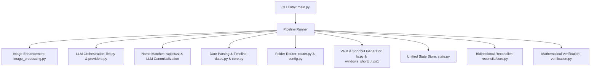

# Tech Stack

## Overview
File Organizer is a specialized document processing, classification, and organization system built in Python. It ingests mixed multi-page PDF archives, applies computer-vision image enhancement, leverages multi-modal LLMs for page-level classification and semantic boundary grouping, and outputs a normalized immutable **Vault** referenced by categorized Windows `.lnk` shortcuts and chronological timeline views.

---

## Runtime & Environment

| Component | Specification | Description |
| :--- | :--- | :--- |
| **Language** | Python 3.12+ (CPython) | Core application runtime utilizing modern typing and pattern matching |
| **Target OS** | Windows 10 / 11 (x64) | Primary operating environment with Windows Shell and COM integration |
| **Shell Environment** | PowerShell 5.1+ / 7+ | Interop execution for COM shortcut generation and batch file management |
| **Encoding** | UTF-8 (`PYTHONIOENCODING=utf8`) | Strict multi-lingual Arabic and English character processing |

---

## Core Dependencies & Libraries

### 1. PDF & Document Processing
- **[PyMuPDF (`fitz`)](file:///C:/Users/Emad/Documents/GitHub/file-organizer/src/pdf/image_processing.py#L12)** (`PyMuPDF`)
  - **Purpose**: Low-level PDF document parsing, page-level rendering, segment splitting, image extraction, and file size optimization.
  - **Key Operations**:
    - High-resolution page rasterization at 300 DPI (`page.get_pixmap(dpi=300)`).
    - Lossless PDF page insertion, re-ordering, and extraction (`dst_doc.insert_pdf(...)`).
    - Embedded image downsampling (max dimension 1500px) and JPEG compression.
    - Garbage collection and stream deflation (`doc.save(..., garbage=4, deflate=True)`).

### 2. Computer Vision & Image Enhancement
- **[OpenCV (`cv2`)](file:///C:/Users/Emad/Documents/GitHub/file-organizer/src/pdf/image_processing.py#L13)** (`opencv-python`) & **[NumPy](file:///C:/Users/Emad/Documents/GitHub/file-organizer/src/pdf/image_processing.py#L14)** (`numpy`)
  - **Purpose**: Pre-OCR/LLM image cleanup to maximize Arabic handwriting and degraded scan readability.
  - **Enhancement Pipeline**:
    1. *Green Channel Extraction*: Filters color noise from official stamp backgrounds.
    2. *Auto-Deskewing*: Text angle detection via Otsu thresholding + `cv2.minAreaRect`, affine rotation (`cv2.warpAffine`).
    3. *Illumination Normalization*: Large-kernel morphological dilation (`15x15`) and Gaussian blur (`21x21`) background division.
    4. *Tonal Mapping*: White-point/black-point level remapping (`cv2.LUT`).
    5. *Diacritic Boosting*: Morphological Black-Hat filter (`3x3` rectangular structuring element) subtraction to emphasize Arabic diacritics/dots (*Tashkeel* and *I'jam*).
    6. *Unsharp Masking*: High-frequency edge enhancement with Gaussian weighting.

### 3. LLM Orchestration & Artificial Intelligence
- **[Google GenAI SDK](file:///C:/Users/Emad/Documents/GitHub/file-organizer/src/llm/providers.py#L12)** (`google-genai`)
  - **Purpose**: Primary multimodal document understanding, categorization, date extraction, and semantic document boundary detection.
  - **Key Features**: Direct structured output schema binding (`GenerateContentConfig(response_schema=...)`), inline PIL image encoding.
- **[OpenAI Python Client](file:///C:/Users/Emad/Documents/GitHub/file-organizer/src/llm/providers.py#L14)** (`openai`)
  - **Purpose**: Alternative backend client for OpenRouter and Groq provider integrations.
- **[Tenacity](file:///C:/Users/Emad/Documents/GitHub/file-organizer/requirements.txt#L2)** (`tenacity`)
  - **Purpose**: Declarative retry and exponential backoff handling for network resilience.

### 4. Data Validation & Configuration
- **[Pydantic v2](file:///C:/Users/Emad/Documents/GitHub/file-organizer/src/core/schemas.py#L6)** (`pydantic`)
  - **Purpose**: Strict runtime data validation, schema enforcement for LLM responses, and data modeling (`BaseModel`, `Field`, `field_validator`, `AliasChoices`).
  - **Dynamic Schemas**: Runtime Pydantic model generation (`create_model`) in `categorization.py` to enforce category enum validation dynamically from YAML configs.
- **[PyYAML](file:///C:/Users/Emad/Documents/GitHub/file-organizer/src/core/config.py#L7)** (`PyYAML`)
  - **Purpose**: Hierarchical configuration loading for `config.yaml`, `categories.yaml`, and tenant timelines (`{house_id}_tenants.yaml`).
- **[python-dotenv](file:///C:/Users/Emad/Documents/GitHub/file-organizer/src/main.py#L14)** (`python-dotenv`)
  - **Purpose**: Automated `.env` file parsing for secrets and API keys (`GEMINI_API_KEY`, `OPENROUTER_API_KEY`, `GROQ_API_KEY`).

### 5. String Processing & Multi-Calendar Date Parsing
- **[RapidFuzz](file:///C:/Users/Emad/Documents/GitHub/file-organizer/src/grouping/name_matcher.py#L4)** (`rapidfuzz`)
  - **Purpose**: Levenshtein-based fuzzy string matching (`fuzz.ratio`) with similarity clustering (threshold $\ge 85$) for normalizing Arabic tenant name variations and OCR typos.
- **[HijriDate](file:///C:/Users/Emad/Documents/GitHub/file-organizer/src/timeline/dates.py#L94)** (`hijridate`)
  - **Purpose**: Conversion of Islamic lunar Hijri calendar dates (years ~1300–1500 AH) to Gregorian calendar standard ISO-8601 strings (`YYYY-MM-DD`).
- **Unicode & Arabic NLP (`unicodedata`, `re`)**
  - **Purpose**: NFKC character normalization, diacritic stripping, alef normalization (`[أإآ]` $\rightarrow$ `ا`), teh marbuta normalization (`ة` $\rightarrow$ `ه`), and alef maksura unification (`ى` $\rightarrow$ `ي`).

### 6. OS Integration & Filesystem Synchronization
- **[PowerShell COM Interop Script](file:///C:/Users/Emad/Documents/GitHub/file-organizer/src/utils/windows_shortcut.ps1)**
  - **Purpose**: Native Windows shell integration executing C# P/Invoke COM interfaces (`IShellLinkW`, `IPersistFile`) for high-speed batch `.lnk` creation and resolution.
- **[pylnk3](file:///C:/Users/Emad/Documents/GitHub/file-organizer/requirements.txt#L15)** (`pylnk3`)
  - **Purpose**: Cross-platform reference and verification tool for parsing Windows shortcut binaries.
- **[Filelock](file:///C:/Users/Emad/Documents/GitHub/file-organizer/requirements.txt#L14)** & Custom PID Locks (`src/watcher/lock.py`)
  - **Purpose**: Inter-process synchronization and inbox watcher mutual exclusion (`os.open` with `O_CREAT | O_EXCL`).

### 7. CLI & Terminal Presentation
- **[Rich](file:///C:/Users/Emad/Documents/GitHub/file-organizer/src/presentation/ui.py#L2)** (`rich`)
  - **Purpose**: Terminal formatting, tree-view rendering for output hierarchy (`rich.tree.Tree`), metric tables (`rich.table.Table`), and console coloring.
- **Standard Library `argparse`**
  - **Purpose**: CLI subcommands: `create`, `prepend`, `reconcile`, `migrate`, `verify`, `undo`.

---

## Architectural Patterns & Modules

### Key Architectural Concepts
1. **Vault Architecture**: Raw PDF documents are decomposed and stored immutably in `.source_files/vault/doc_{vid}.pdf`.
2. **Virtual Shortcutting**: Categorized tenant directories (`01_بيانات شخصية`, `05_عقود`, etc.) and the chronological `[Timeline View]` contain lightweight Windows `.lnk` shortcuts pointing into the immutable vault.
3. **State as Single Source of Truth**: All page ranges, document classifications, tenant assignments, dates, and shortcut paths are tracked in `.source_files/{house_id}_state.json`.
4. **Bidirectional Reconciliation**: File moves or deletions manually executed by users on disk are reconciled back into `state.json` via `reconcile/core.py`.
5. **Atomic Filesystem Operations**: All state writes and file updates use temporary files with retry loops (`atomic_write`) to prevent corruption from external locks (e.g. OneDrive, Windows Search Indexer, Antivirus).

---

## Testing Infrastructure

| Test Suite | Tooling | Scope |
| :--- | :--- | :--- |
| **Unit & Schema Tests** | `pytest` | Validates Pydantic models, indexing conversions, date parsing, command syntax |
| **Provider & Mock Tests** | `pytest`, `MockLLMProvider` | Tests failover cascades, rate limits (429 recovery), timeout fallbacks |
| **Reconciliation Tests** | `pytest`, temporary directory sandboxes | Tests ghost adoption, broken shortcut repair, tenant reallocation |
| **Golden Data Evaluations** | `tests/golden_data/` | Evaluates classification accuracy, boundary detection, and routing against benchmark PDFs |
