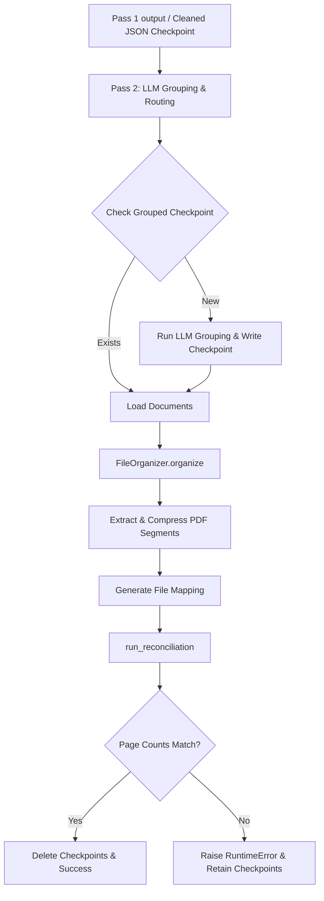

<user_constraints>
## User Constraints (from CONTEXT.md)

### Locked Decisions
### Folder Structure & Naming
- **D-01:** Topic folder names use a number prefix + English slug, matching the existing `routing.py` pattern (e.g., `01_requests_and_applications`, `02_personal_details`, ..., `13_others`). The 13 folder names are already defined in `src/processing/routing.py` -> `FOLDER_ROUTING`.
- **D-02:** Tenant directory names use the canonical Arabic name + timeline year range: e.g., `علي محمد 2018-2023/`. The existing `sanitize_filename()` (FS-01) handles Windows-reserved char stripping and NFC normalization -- no transliteration needed.
- **D-03:** The Unassigned folder's period is inferred from the **date range of unassigned pages** (min_date to max_date of pages routed to Unassigned). Folder name: `غير محدد {year_start}-{year_end}/` (or just `غير محدد/` if all dates are null).
- **D-04 (user override):** Topic subdirectories are created **on-demand only** -- a folder is created when at least one document routes to it. Empty topic folders are NOT pre-created, even though OUT-03 stated "even if empty". This was explicitly overridden by the user during discussion.

### Checkpoint / Resume
- **D-05:** Two checkpoint files are used:
  1. `output/{house_id}_cleaned.json` -- Pass 1 checkpoint (already implemented in `organize.py`). No changes needed.
  2. `output/checkpoints/grouped.json` -- Pass 2 checkpoint: the full `DocumentGroup` list serialized as JSON, saved **after LLM grouping/routing completes and before PDF splitting begins**. On restart, if this file exists, skip grouping/routing and go straight to PDF splitting.
- **D-06:** Both checkpoint files are deleted **after a successful reconciliation pass** (page counts match). This is the cleanup trigger -- not on pipeline completion alone.

### Reconciliation Manifest & Report
- **D-07:** Manifest format: JSON file at `output/{house_id}_manifest.json`. Structure:
  ```json
  {
    "summary": {
      "house_id": "...",
      "total_input_pages": 0,
      "total_output_pages": 0,
      "output_file_count": 0,
      "unaccounted_pages": []
    },
    "per_page": [
      {
        "page_index": 0,
        "tenant": "...",
        "date": "...",
        "output_file": "relative/path/to/file.pdf",
        "page_in_output": 1
      }
    ]
  }
  ```
- **D-08:** If the reconciliation check fails (total input pages != total output pages), the pipeline **halts and raises a `RuntimeError`**. Mismatches must not silently pass. The manifest is still written before raising so the operator can inspect which pages are unaccounted for.

### FileOrganizer Refactor
- **D-09:** `src/processing/organizer.py` is **rewritten in-place** -- same filename and same `FileOrganizer` class name (so `organize.py`'s import is unchanged), but rebuilt with the full Phase 4 responsibility:
  1. Accept the `house_id` as a parameter to set the house-level root dir
  2. Build tenant dirs with canonical Arabic name + timeline
  3. Handle the Unassigned tenant folder with inferred period
  4. Create topic dirs on-demand only (D-04)
  5. Write PDFs using `extract_pdf_segment()` from `split.py`
  6. Return a page-index -> output-file mapping for use in reconciliation

### the agent's Discretion
- **D-10 (agent discretion):** Reconciliation logic lives in a separate helper function `run_reconciliation(summary, total_input_pages, house_id, output_dir)` -- called from `organize.py` after `FileOrganizer.organize()` returns. This keeps `FileOrganizer` focused on writing files and reconciliation as an explicit final step.
- Manifest is written to `output/{house_id}_manifest.json` (alongside the cleaned.json checkpoint) -- consistent location with other pipeline artifacts.
- The `output/checkpoints/` dir is created by `organize.py` before the grouping step runs, so checkpoint writes never fail due to missing parent.

### Deferred Ideas (OUT OF SCOPE)
None -- discussion stayed within phase scope.
</user_constraints>

<phase_requirements>
## Phase Requirements

| ID | Description | Research Support |
|----|-------------|------------------|
| OUT-01 | Create house-level directory from filename | Mapped to `organize.py` output_dir processing |
| OUT-02 | Create tenant-level directories with timeline | Addressed by D-02 timeline aggregation logic |
| OUT-03 | Create all 13 topic subdirectories (override) | See D-04: On-demand creation only |
| OUT-04 | 13 folders and allowed categories hardcoded | Reuse `FOLDER_ROUTING` in `src/processing/routing.py` |
| OUT-05 | Create "Unassigned" folder with inferred period | See D-03: `غير محدد {year_start}-{year_end}/` |
| OUT-06 | Page count reconciliation | Mapped to new `run_reconciliation` function and D-08 check |
| LOG-04 | Reconciliation report at pipeline end | Handled by D-07 manifest structure |
| DIFF-02 | Checkpoint/resume logic | Implemented via Pass 2 checkpoint (D-05) |
| DIFF-03 | Reconciliation manifest | Addressed by D-07 manifest JSON schema |
</phase_requirements>

# Phase 4: Output Structure & Reconciliation - Research

**Researched:** 2026-07-05
**Domain:** File System Organization and Audit Trails
**Confidence:** HIGH

## Summary

This phase focuses on finalizing the document hierarchy on the disk, mapping structured PDF page segments to their final structured directories, persisting progress via checkpoints, and enforcing a strict audit trail through a reconciliation step. The changes touch `src/organize.py` for checkpoint integration and `src/processing/organizer.py` for directory layout mapping.

**Primary recommendation:** Rewrite `FileOrganizer` to return page mappings required by the reconciliation manifest and invoke reconciliation at the tail-end of `organize.py`. Use atomic writes for checkpoints and manifests to prevent partial corruption.

## Architectural Responsibility Map

| Capability | Primary Tier | Secondary Tier | Rationale |
|------------|-------------|----------------|-----------|
| File Writing & Routing | Filesystem Layer (`organizer.py`) | Processing Layer (`split.py`) | `organizer.py` computes paths; `split.py` extracts/compresses physical files. |
| Verification & Reconciliation | Audit Layer (`run_reconciliation`) | `organizer.py` (Telemetry Provider) | Reconciliation validates page conservation logic entirely separate from core file writing. |
| Checkpoint Persistence | Persistence Layer (`organize.py`) | — | File entry-point saves application state locally for restartability. |

## Standard Stack

### Core
| Library | Version | Purpose | Why Standard |
|---------|---------|---------|--------------|
| `pymupdf` (fitz) | >=1.28.0 | PDF Segment extraction | Blazing fast C-based extraction and splitting; existing project dependency |
| `pydantic` | >=2.x.x | Data models | Standardizing checkpoint serialization via `.model_dump()` and deserialization via `**kwargs` |
| `pathlib` | Built-in | Path manipulation | Standard Python OS/Path-safe routing generation |
| `json` | Built-in | Manifest generation | Core serialization protocol for checkpoints and reports |

### Alternatives Considered
| Instead of | Could Use | Tradeoff |
|------------|-----------|----------|
| Custom dict manifest | Pydantic model for manifest | Custom dictionary is lighter given we only serialize once per run, but Pydantic provides type guarantees. D-07 dictates structure which we can satisfy via raw dicts. |

**Installation:**
```bash
# No new packages to install. Relies on existing requirements in requirements.txt.
```

**Version verification:**
- `pymupdf`: Existing project dependency, version confirmed via stack constraints.
- `pydantic`: Existing project dependency.

## Package Legitimacy Audit

> **Required** whenever this phase installs external packages.

| Package | Registry | Age | Downloads | Source Repo | Verdict | Disposition |
|---------|----------|-----|-----------|-------------|---------|-------------|
| *None* | — | — | — | — | OK | No new packages |

## Architecture Patterns

### System Architecture Diagram


### Pattern 1: Atomic File System Operations
**What:** Writing checkpoints and manifests to temporary files, then replacing them atomically.
**When to use:** Whenever pipeline failure mid-write could corrupt state.
**Example:**
```python
tmp_path = target_path.with_suffix('.tmp')
with open(tmp_path, 'w', encoding='utf-8') as f:
    json.dump(data, f, ensure_ascii=False, indent=2)
tmp_path.replace(target_path)
```

### Anti-Patterns to Avoid
- **[Anti-pattern]:** Skipping checkpoint deletion. Checkpoints MUST be deleted only after `run_reconciliation` passes (D-06). Deleting them at the end of grouping defeats the ability to retry splitting/reconciliation without another LLM cost.

## Don't Hand-Roll

| Problem | Don't Build | Use Instead | Why |
|---------|-------------|-------------|-----|
| Safe Path Names | Custom regex | `src.core.utils.sanitize_filename` | Already accounts for Windows reserved characters and NFC constraints. |
| PDF Page Range extraction | Custom PDF subset logic | `extract_pdf_segment` from `split.py` | It correctly extracts and automatically handles compression. |

## Common Pitfalls

### Pitfall 1: Unassigned Folder Date Inference
**What goes wrong:** The unassigned folder gets named `غير محدد None-None` or fails if no dates exist.
**Why it happens:** Documents assigned to "unknown" may lack resolved dates entirely, or their dates might not be properly reduced to min/max.
**How to avoid:** Ensure the `min_date` to `max_date` reduction safely filters out nulls/NONE values. If list is empty, name directory exactly `غير محدد/`.

### Pitfall 2: Silent Reconciliation Failures
**What goes wrong:** A bug causes unaccounted pages, but the pipeline completes successfully, hiding the error.
**Why it happens:** Reconciliation function logs an error but does not throw an exception.
**How to avoid:** Explicitly raise `RuntimeError("Reconciliation failed: total input pages != total output pages")` (D-08).

## Code Examples

Verified patterns from official sources:

### [Loading and Saving Pass 2 Checkpoint]
```python
# Save grouped documents
checkpoint_dir = target_dir / "output" / "checkpoints"
checkpoint_dir.mkdir(parents=True, exist_ok=True)
checkpoint_file = checkpoint_dir / "grouped.json"

if checkpoint_file.exists():
    with open(checkpoint_file, 'r', encoding='utf-8') as f:
        documents = [DocumentGroup(**d) for d in json.load(f)]
else:
    documents = pipeline._group_and_route_documents(raw_pages, None)
    with open(checkpoint_file, 'w', encoding='utf-8') as f:
        json.dump([doc.model_dump() for doc in documents], f, ensure_ascii=False, indent=2)
```

## State of the Art

| Old Approach | Current Approach | When Changed | Impact |
|--------------|------------------|--------------|--------|
| Creating all 13 folders pre-emptively | On-demand folder creation | D-04 User override | Cleaner output directories with fewer empty subdirectories, easier manual parsing. |
| Pure forward processing | Checkpoint-based execution | D-05 | Massively saves on token and time costs during dev/retry cycles by skipping Pass 2 LLM groups. |

## Assumptions Log

| # | Claim | Section | Risk if Wrong |
|---|-------|---------|---------------|
| A1 | No assumptions | — | — |

## Open Questions
None. Scope is fully defined in CONTEXT.md.

## Environment Availability

> Step 2.6: SKIPPED (no external dependencies identified)

## Validation Architecture

### Test Framework
| Property | Value |
|----------|-------|
| Framework | pytest 8.x |
| Config file | none — see Wave 0 |
| Quick run command | `pytest tests/test_organizer.py -v` |
| Full suite command | `pytest` |

### Phase Requirements → Test Map
| Req ID | Behavior | Test Type | Automated Command | File Exists? |
|--------|----------|-----------|-------------------|-------------|
| OUT-01 | Create house directory | unit | `pytest tests/test_organizer.py::test_create_house_directory -x` | ✅ Wave 0 |
| OUT-02 | Create tenant directories with timeline | unit | `pytest tests/test_organizer.py::test_tenant_directories_timeline -x` | ✅ Wave 0 |
| OUT-03 | On-demand topic directories | unit | `pytest tests/test_organizer.py::test_on_demand_topic_creation -x` | ✅ Wave 0 |
| OUT-04 | Hardcoded routing rules | unit | `pytest tests/test_organizer.py::test_hardcoded_routing -x` | ✅ Wave 0 |
| OUT-05 | Unassigned folder with inferred period | unit | `pytest tests/test_organizer.py::test_unassigned_folder_period -x` | ✅ Wave 0 |
| OUT-06 | Page count reconciliation check | unit | `pytest tests/test_organizer.py::test_page_count_reconciliation -x` | ✅ Wave 0 |
| LOG-04 | Write reconciliation report | unit | `pytest tests/test_organizer.py::test_reconciliation_manifest -x` | ✅ Wave 0 |
| DIFF-02 | Checkpoint and resume pipeline | integration | `pytest tests/test_pipeline_pass2.py::test_checkpoint_resume -x` | ✅ Wave 0 |
| DIFF-03 | Generate reconciliation manifest | unit | `pytest tests/test_organizer.py::test_reconciliation_manifest_generation -x` | ✅ Wave 0 |

### Sampling Rate
- **Per task commit:** `pytest tests/test_organizer.py`
- **Per wave merge:** `pytest`
- **Phase gate:** Full suite green before `/gsd-verify-work`

### Wave 0 Gaps
- [ ] `tests/test_organizer.py` — expand existing tests to cover Phase 4 rewrite logic.
- [ ] `tests/test_pipeline_pass2.py` — add test for checkpoint creation and loading.

## Security Domain

### Applicable ASVS Categories

| ASVS Category | Applies | Standard Control |
|---------------|---------|-----------------|
| V2 Authentication | no | — |
| V3 Session Management | no | — |
| V4 Access Control | no | — |
| V5 Input Validation | yes | `pydantic` schemas for DocumentGroup; `sanitize_filename` |
| V6 Cryptography | no | — |

### Known Threat Patterns for Python/CLI

| Pattern | STRIDE | Standard Mitigation |
|---------|--------|---------------------|
| Directory Traversal / File Overwrite | Tampering | Use `utils.sanitize_filename` and ensure `output_base_dir` bounds. |
| Malicious PDF Parsing (Decompression Bomb) | Denial of Service | `Image.MAX_IMAGE_PIXELS` set in `split.py` compression block |

## Sources

### Primary (HIGH confidence)
- Project Constraints: `GEMINI.md`
- Context document: `.planning/phases/04-output-structure-reconciliation/04-CONTEXT.md`
- Codebase Architecture: `src/processing/organizer.py` and `src/processing/split.py`

## Metadata

**Confidence breakdown:**
- Standard stack: HIGH - Core Python stdlib + established Pydantic/PyMuPDF patterns
- Architecture: HIGH - Matches existing pipeline flow
- Pitfalls: HIGH - Addressed specific edge cases in parsing

**Research date:** 2026-07-05
**Valid until:** 30 days
