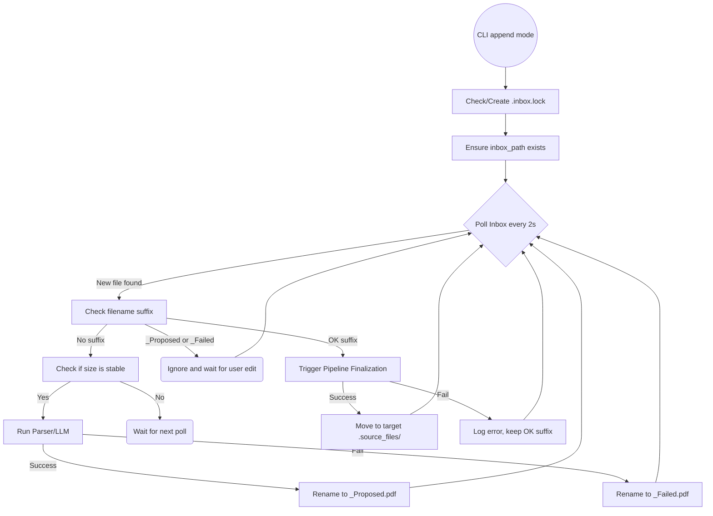

# Phase 24: FS-UI Orchestration - Research

**Researched:** 2026-07-20
**Domain:** File-System Polling, Orchestration, Process Locking
**Confidence:** HIGH

## Summary

This phase introduces the File-System UI listener loop, enabling a stateful, interactive filing experience through the filesystem. The listener monitors an `inbox_path` for new PDFs, leverages the existing parsing and inference logic (from Phase 23) to determine filing destinations, and communicates proposals to the user by renaming files (appending `_Proposed` or `_Failed`). Upon user approval (appending ` OK` to the filename), the system triggers the finalization pipeline.

**Primary recommendation:** Implement a state-free, polling-based `FSUIOrchestrator` class that derives all state directly from filesystem names and uses a simple sleep loop with stable-size checks to process files safely.

## Architectural Responsibility Map

| Capability | Primary Tier | Secondary Tier | Rationale |
|------------|-------------|----------------|-----------|
| Polling loop (listener) | CLI / Orchestrator | — | The entry point runs a foreground blocking loop. |
| Intention inference | API / Backend | Orchestrator | LLM parsing logic exists in backend; orchestrator invokes it. |
| Proposal (rename `_Proposed`) | Orchestrator | File System | State is fully persisted in the filename on disk. |
| Finalization (` OK` trigger) | Orchestrator | Document Pipeline | Orchestrator routes approved files through the main pipeline. |
| Process lock management | Orchestrator | File System | Ensures only one listener runs per inbox via `.inbox.lock`. |

<user_constraints>
## User Constraints (from CONTEXT.md)

### Locked Decisions
- **D-01:** Implement a simple polling loop (1-2s interval) running in the foreground blocking the terminal (until Ctrl+C).
- **D-02:** Wait until a file's size is stable between polls before processing to handle files that are actively being copied/written.
- **D-03:** Auto-create the `inbox_path` using `os.makedirs` if it doesn't exist when the listener starts.
- **D-04:** Check if the process ID (PID) inside `.inbox.lock` is still alive. If not, auto-recover and overwrite the stale lock.
- **D-05:** Do not print periodic heartbeats (e.g., "Listening...") to avoid console spam. Print only once at startup and subsequently only on actual events (e.g., file found, moved, or error).
- **D-06:** No explicit reject keyword is needed. If the user disagrees with the proposal, they manually edit the filename. The system will treat any file that lacks both `_Proposed` and ` OK` suffixes as a fresh file and restart the loop.
- **D-07:** If the parser/LLM fails to infer missing data, append `_Failed` or `_Error` to the filename to signal the user for manual intervention and to prevent infinite inference loops.
- **D-08:** The listener must be completely stateless. It relies entirely on the filename (`_Proposed`, `_Failed`, ` OK`) for state. It must not use internal memory (dictionaries/sets) to track processed files.
- **D-09:** On restart, if the listener finds files already marked `_Proposed`, it leaves them alone and waits for user action (approval or edit).
- **D-10:** On restart, if the listener finds files marked ` OK`, it immediately processes and finalizes them.
- **D-11:** Finalized files disappear silently from the Inbox. No trace or log file is left behind in the Inbox.
- **D-12:** If the OS move fails (e.g., disk full, permissions issue), abort the move but keep the ` OK` filename. Print a user-friendly error to the console (and log the full trace to a file). This allows the system to retry automatically once the issue is resolved without wasting LLM calls.
- **D-13:** If a file with the exact same name already exists in the destination folder, append a timestamp or counter to the filename to avoid overwriting.

### the agent's Discretion
None — all options were explicitly chosen.

### Deferred Ideas (OUT OF SCOPE)
None — discussion stayed within phase scope.
</user_constraints>

<phase_requirements>
## Phase Requirements

| ID | Description | Research Support |
|----|-------------|------------------|
| FSUI-04 | System can propose its filing intention by renaming the PDF in the Inbox (e.g. appending `_Proposed`). | Built-in `os.rename` and `pathlib.Path` handle cross-platform file renaming seamlessly. |
| FSUI-05 | System watches the Inbox for user approval (indicated by appending ` OK` to the filename) and finalizes the filing process upon detection. | A simple polling loop checking for the ` OK.pdf` suffix handles this statelessly. |
| FSUI-06 | FS-UI listener and orchestration is implemented using a class-based architecture to encapsulate state, keeping it strictly separated from the functional document pipeline. | `FSUIOrchestrator` class will encapsulate the polling logic, lock management, and size-stability checks. |
</phase_requirements>

## Standard Stack

### Core
| Library | Version | Purpose | Why Standard |
|---------|---------|---------|--------------|
| `os` / `pathlib` | built-in | File operations | Standard library for cross-platform path manipulation and file moves. |
| `time` | built-in | Polling delay | Simple, reliable, and avoids the complexity of `asyncio` or heavy event loops for a single-threaded blocking CLI. |

### Supporting
| Library | Version | Purpose | When to Use |
|---------|---------|---------|-------------|
| `shutil` | built-in | Safe file moves | Use `shutil.move` when finalizing the file into the target directory, as it handles cross-device moves gracefully. |

### Alternatives Considered
| Instead of | Could Use | Tradeoff |
|------------|-----------|----------|
| Polling (`time.sleep`) | `watchdog` library | `watchdog` provides inotify/fsevents triggers but is notoriously complex, introduces an external dependency, and often has double-fire events. A simple polling loop (1-2s) is vastly simpler and robust for this domain. |

## Architecture Patterns

### System Architecture Diagram



### Recommended Project Structure
```text
src/
├── fs_ui/                 # New module for the orchestrator
│   ├── __init__.py
│   ├── orchestrator.py    # Class-based polling, renaming, and lock management
│   └── lock.py            # PID locking utilities
├── main.py                # Updated to invoke FSUIOrchestrator in append mode
```

### Pattern 1: Stateless Filesystem Processing
**What:** Deriving the current state of an item purely from its name on disk, rather than an in-memory dictionary.
**When to use:** When building filesystem-based UI loops that must be resilient to sudden crashes and restarts.
**Example:**
```python
def process_inbox(self):
    for filepath in self.inbox_path.glob("*.pdf"):
        name = filepath.stem
        if name.endswith(" OK"):
            self.finalize(filepath)
        elif name.endswith("_Proposed") or name.endswith("_Failed") or name.endswith("_Error"):
            continue # Waiting for user
        else:
            self.propose(filepath)
```

### Anti-Patterns to Avoid
- **In-memory state tracking:** Do not use `seen_files = set()` to avoid reprocessing. If the script restarts, it will lose track. The filename must dictate the state.
- **Immediate processing of new files:** Do not process a file the instant it appears. It may still be copying. Wait for the file size to remain identical across two polls.

## Don't Hand-Roll

| Problem | Don't Build | Use Instead | Why |
|---------|-------------|-------------|-----|
| Moving files | `os.rename(src, dest)` | `shutil.move(src, dest)` | `os.rename` fails across filesystem boundaries (e.g. from a USB drive to main disk). `shutil.move` gracefully falls back to copy+delete. |
| PID liveness check | Complex lockfiles | `os.kill(pid, 0)` | On Unix (Mac), `os.kill(pid, 0)` safely checks if a process exists without sending an actual termination signal. |

## Common Pitfalls

### Pitfall 1: Processing Partially Copied Files
**What goes wrong:** The listener picks up a PDF, tries to parse it, and fails because the OS hasn't finished writing the file.
**Why it happens:** The `os.listdir` or `glob` trigger happens immediately when the inode is created, but data blocks are still streaming.
**How to avoid:** Implement a size-stability check. Record the file's size on the first poll, and only process it on the next poll if the size is `> 0` and hasn't changed.
**Warning signs:** Corrupt PDF errors during pipeline extraction.

### Pitfall 2: Infinite Inference Loops
**What goes wrong:** The LLM fails to infer data, the file is left alone, and the listener immediately tries to run inference again on the next tick.
**Why it happens:** No state is recorded for failures.
**How to avoid:** Explicitly append `_Failed` or `_Error` so the stateless loop knows it has already tried and failed, leaving it for the user.

## Code Examples

Verified patterns from official sources:

### POSIX Process Liveness Check (Mac)
```python
import os

def is_pid_alive(pid: int) -> bool:
    try:
        os.kill(pid, 0)
        return True
    except OSError:
        return False
```

### Safe Overwrite Protection
```python
import time
from pathlib import Path

def get_safe_dest(dest_dir: Path, filename: str) -> Path:
    target = dest_dir / filename
    if target.exists():
        stem = target.stem
        ext = target.suffix
        timestamp = int(time.time())
        target = dest_dir / f"{stem}_{timestamp}{ext}"
    return target
```

## Validation Architecture

### Test Framework
| Property | Value |
|----------|-------|
| Framework | pytest |
| Config file | conftest.py |
| Quick run command | `pytest tests/test_fs_ui_orchestrator.py -x` |
| Full suite command | `pytest` |

### Phase Requirements → Test Map
| Req ID | Behavior | Test Type | Automated Command | File Exists? |
|--------|----------|-----------|-------------------|-------------|
| FSUI-04 | File renamed to _Proposed | unit | `pytest tests/test_fs_ui_orchestrator.py::test_propose_rename` | ❌ Wave 0 |
| FSUI-05 | File ending in OK triggers finalization | integration | `pytest tests/test_fs_ui_orchestrator.py::test_ok_finalization` | ❌ Wave 0 |
| FSUI-06 | Size stability delays processing | unit | `pytest tests/test_fs_ui_orchestrator.py::test_size_stability` | ❌ Wave 0 |
| FSUI-06 | Stale lock is overwritten | unit | `pytest tests/test_fs_ui_orchestrator.py::test_stale_lock_recovery` | ❌ Wave 0 |

### Wave 0 Gaps
- [ ] `tests/test_fs_ui_orchestrator.py` — covers FSUI-04, FSUI-05, FSUI-06

## Security Domain

### Applicable ASVS Categories

| ASVS Category | Applies | Standard Control |
|---------------|---------|-----------------|
| V2 Authentication | no | — |
| V3 Session Management | no | — |
| V4 Access Control | no | — |
| V5 Input Validation | yes | `pathlib` strict path resolution |
| V6 Cryptography | no | — |

### Known Threat Patterns for File System Observers

| Pattern | STRIDE | Standard Mitigation |
|---------|--------|---------------------|
| Path Traversal via Filename | Tampering | Never trust the filename to traverse directories (e.g. `../`). Always map components explicitly and use `.resolve()`. |
| Symlink loops | Denial of Service | Avoid following symlinks in the inbox loop (`.resolve(strict=True)` where appropriate). |

## Sources

### Primary (HIGH confidence)
- Python Standard Library (`os`, `shutil`, `pathlib`) - Stable file IO and process operations.

## Metadata

**Confidence breakdown:**
- Standard stack: HIGH - Core Python libraries are perfectly suited for this domain.
- Architecture: HIGH - Stateless filesystem processing is robust and aligns directly with the user constraints.
- Pitfalls: HIGH - Partial file copying is a known universal pitfall with watchers.

**Research date:** 2026-07-20
**Valid until:** Indefinite
