# Comprehensive Architecture & Directory Map (`src/`)

This document presents a comprehensive, subsystem-level architecture diagram and detailed directory reference for the **File Organizer** codebase under `src/`.

---

## 🏗 Detailed System Architecture Diagram

```mermaid
graph TD
    %% Entry Points
    subgraph EntryPoints["🚀 Entry Points & Control Layer"]
        MAIN["src/main.py<br/><i>(Thin CLI Entrypoint)</i>"]
        ORCH["src/fs_ui/orchestrator.py<br/><i>(FS UI & Append Watcher)</i>"]
        LOCK["src/fs_ui/lock.py<br/><i>(Process Locking)</i>"]
    end

    %% High Level Pipeline Runner
    subgraph PipelineRunnerLayer["⚡ Pipeline Execution Layer (src/pipeline/)"]
        RUNNER["src/pipeline/runner.py<br/><b>Pass Wrapper Functions</b>"]
        PASS1["run_cleaning_pass()"]
        PASS2["run_grouping_pass()"]
        PASS3["run_routing_pass()"]
        PASS4["run_generation_pass()"]
        
        PIPE["src/pipeline/pipeline.py<br/><i>(Low-level Pipeline Class)</i>"]
        VIS["src/pipeline/visualizer.py<br/><i>(Visualizer)</i>"]
    end

    %% Business Logic Engines
    subgraph Engines["🧠 Core Business Logic Subsystems"]
        subgraph CatSub["1. Categorization Engine (src/categorization/)"]
            CAT["categorization.py<br/><i>(Extract & Classify)</i>"]
        end

        subgraph GroupSub["2. Page Grouping System (src/grouping/)"]
            G_CORE["core.py<br/><i>(Multi-page Clustering)</i>"]
            G_MATCH["name_matcher.py<br/><i>(Fuzzy Matching)</i>"]
            G_CFG["config.py"]
            G_STATE["state.py"]
            G_UTIL["utils.py"]
        end

        subgraph RouteSub["3. Destination Router (src/routing/)"]
            R_ROUTER["router.py<br/><i>(Path Resolver)</i>"]
            R_CFG["config.py"]
            R_STATE["state.py"]
        end

        subgraph TimeSub["4. Timeline & Dates (src/timeline/)"]
            T_CORE["core.py<br/><i>(Timeline Engine)</i>"]
            T_DATES["dates.py<br/><i>(Date Parser)</i>"]
            T_PHASE["phase.py"]
            T_RECON["reconciliation.py"]
            T_BUILD["timeline_builder.py"]
        end

        subgraph ReconSub["5. Reconciler (src/reconcile/)"]
            REC_CORE["core.py<br/><i>(Manifest Diffing)</i>"]
        end

        subgraph InboxSub["6. Inbox Ingestion (src/inbox/)"]
            INB_PARSER["parser.py"]
            INB_RESOLV["resolver.py"]
        end
    end

    %% Foundation & Services Layer
    subgraph Foundation["🔧 Supporting Infrastructure Subsystems"]
        subgraph CoreSub["Data Contracts (src/core/)"]
            MODELS["models.py<br/>(PageData)"]
            SCHEMAS["schemas.py<br/>(DocumentGroup)"]
            CORE_CFG["config.py"]
            EXCEPTIONS["exceptions.py"]
            INDEXING["indexing.py"]
            CORE_UI["ui.py"]
        end

        subgraph LLMSub["LLM Integration (src/llm/)"]
            LLM_CLIENT["llm.py<br/>(LLMClient / Gemini)"]
            LLM_PROV["providers.py"]
            LLM_MOCK["mock.py"]
        end

        subgraph PDFSub["PDF Engine (src/pdf/)"]
            PDF_COMP["compress.py"]
            PDF_EXTR["extract.py"]
            PDF_IMG["image_processing.py"]
        end

        subgraph TenantSub["Tenant Config (src/tenant_config/)"]
            TENANT_LOAD["yaml_loader.py"]
            TENANT_MOD["tenants.py"]
        end

        subgraph UtilSub["System Utilities (src/utils/)"]
            FS_UTIL["fs.py<br/>(Atomic Write)"]
            LOGGER_UTIL["logger.py"]
        end
    end

    %% Checkpoint Files & Outputs
    subgraph Artifacts["📄 Checkpoints & Final Outputs"]
        CHK1["Pass 1 Checkpoint:<br/>house_id_1_cleaned.json"]
        CHK2["Pass 2 Checkpoint:<br/>house_id_2_grouped.json"]
        CHK3["Pass 3 Checkpoint:<br/>house_id_3_routed.json"]
        FINAL_PDF["Final Output PDFs & Organized Folders"]
    end

    %% Connections - Entry Points to Runner
    MAIN -->|Dispatches create| PASS1
    MAIN -->|Dispatches create| PASS2
    MAIN -->|Dispatches create| PASS3
    MAIN -->|Dispatches create| PASS4
    MAIN -->|Dispatches append| ORCH

    ORCH -->|Uses process locking| LOCK
    ORCH -->|Triggers final generation| PASS4

    %% Connections - Runner to Pipeline & Passes
    RUNNER --- PASS1
    RUNNER --- PASS2
    RUNNER --- PASS3
    RUNNER --- PASS4

    PASS1 -->|Invokes| PIPE
    PASS2 -->|Invokes| PIPE
    PASS3 -->|Invokes| PIPE

    PASS1 -->|Writes| CHK1
    PASS2 -->|Reads CHK1 & Writes| CHK2
    PASS3 -->|Reads CHK2 & Writes| CHK3
    PASS4 -->|Reads CHK3 & Generates| FINAL_PDF

    %% Connections - Pipeline to Engines
    PIPE -->|Runs cleaning| CAT
    PIPE -->|Runs grouping| G_CORE
    PIPE -->|Runs routing| R_ROUTER
    PIPE -->|Builds visual graphs| VIS

    G_CORE --> G_MATCH
    G_CORE --> G_STATE
    G_CORE --> G_CFG

    R_ROUTER --> R_STATE
    R_ROUTER --> R_CFG

    PASS4 -->|Organizes files & timeline| T_CORE
    PASS4 -->|Compresses PDF| PDF_COMP
    T_CORE --> T_DATES
    T_CORE --> T_BUILD
    T_CORE --> T_RECON

    MAIN -->|Reconciles manifest| REC_CORE

    %% Infrastructure Usage
    CAT --> LLM_CLIENT
    G_CORE --> LLM_CLIENT
    R_ROUTER --> LLM_CLIENT
    CAT --> PDF_EXTR
    CAT --> PDF_IMG
    PASS1 --> TENANT_LOAD
    PIPE --> SCHEMAS
    PIPE --> MODELS
    RUNNER --> FS_UTIL
```

---

## 📁 File-by-File Job Breakdown

### 1. Root Entrypoint Layer (`src/`)
- [`src/main.py`](file:///C:/Users/Emad/Documents/GitHub/file-organizer/src/main.py)
  - **Job**: Thin CLI Entry Point & Command Dispatcher.
  - **Role**: Parses command-line arguments (`create`, `append`, `reconcile`), sets up logging and environment variables (`GEMINI_API_KEY`), and delegates to `src.pipeline.runner` or `src.fs_ui.orchestrator`.

---

### 2. Pipeline Execution Layer (`src/pipeline/`)
- [`src/pipeline/runner.py`](file:///C:/Users/Emad/Documents/GitHub/file-organizer/src/pipeline/runner.py)
  - **Job**: High-Level Pipeline Pass Runner ("Glue Logic").
  - **Role**: Encapsulates `run_cleaning_pass`, `run_grouping_pass`, `run_routing_pass`, and `run_generation_pass`. Handles checkpoint loading/saving, file management, and output PDF generation. Shared cleanly by both `main.py` and `orchestrator.py`.
- [`src/pipeline/pipeline.py`](file:///C:/Users/Emad/Documents/GitHub/file-organizer/src/pipeline/pipeline.py)
  - **Job**: Low-Level `Pipeline` Core Class.
  - **Role**: Orchestrates raw document cleaning, grouping, and routing algorithms page-by-page.
- [`src/pipeline/visualizer.py`](file:///C:/Users/Emad/Documents/GitHub/file-organizer/src/pipeline/visualizer.py)
  - **Job**: Visualizer & Graph/HTML Generator.
  - **Role**: Renders visual reports and structural graphs for document grouping and pipeline decisions.

---

### 3. File System UI & Append Mode (`src/fs_ui/`)
- [`src/fs_ui/orchestrator.py`](file:///C:/Users/Emad/Documents/GitHub/file-organizer/src/fs_ui/orchestrator.py)
  - **Job**: Dynamic Append Mode Orchestrator & FS UI.
  - **Role**: Monitors target directories for newly added files, manages incremental merging of manifest checkpoints, and triggers `run_generation_pass`.
- [`src/fs_ui/lock.py`](file:///C:/Users/Emad/Documents/GitHub/file-organizer/src/fs_ui/lock.py)
  - **Job**: Concurrency & Process Lock Handler.
  - **Role**: Enforces atomic file locking to prevent concurrent process collision during file system monitoring.

---

### 4. Core System & Data Contracts (`src/core/`)
- [`src/core/models.py`](file:///C:/Users/Emad/Documents/GitHub/file-organizer/src/core/models.py): Data model classes representing individual pages (`PageData`).
- [`src/core/schemas.py`](file:///C:/Users/Emad/Documents/GitHub/file-organizer/src/core/schemas.py): Pydantic schemas for LLM outputs, including `DocumentGroup`.
- [`src/core/config.py`](file:///C:/Users/Emad/Documents/GitHub/file-organizer/src/core/config.py): App-wide configuration parser and settings registry.
- [`src/core/exceptions.py`](file:///C:/Users/Emad/Documents/GitHub/file-organizer/src/core/exceptions.py): Central exception hierarchy (`ConfigurationError`, `ValidationError`, `FileOrganizerError`).
- [`src/core/indexing.py`](file:///C:/Users/Emad/Documents/GitHub/file-organizer/src/core/indexing.py): Page indexing, document numbering, and sequence ID algorithms.
- [`src/presentation/ui.py`](file:///C:/Users/Emad/Documents/GitHub/file-organizer/src/presentation/ui.py): Console formatting, verbosity controls, and terminal UI feedback.
- [`src/core/utils.py`](file:///C:/Users/Emad/Documents/GitHub/file-organizer/src/core/utils.py): Shared utility functions for path sanitization and JSON parsing.
- [`src/core/categories.yaml`](file:///C:/Users/Emad/Documents/GitHub/file-organizer/src/core/categories.yaml): Taxonomy definitions and rules for document categories.

---

### 5. Categorization Engine (`src/categorization/`)
- [`src/categorization/categorization.py`](file:///C:/Users/Emad/Documents/GitHub/file-organizer/src/categorization/categorization.py)
  - **Job**: Document Classification Engine.
  - **Role**: Extracts text/imagery from raw PDFs and queries LLMs to categorize documents based on rules in `categories.yaml`.

---

### 6. Document Grouping System (`src/grouping/`)
- [`src/grouping/core.py`](file:///C:/Users/Emad/Documents/GitHub/file-organizer/src/grouping/core.py): Multi-page clustering algorithm to combine adjacent pages into coherent documents.
- [`src/grouping/config.py`](file:///C:/Users/Emad/Documents/GitHub/file-organizer/src/grouping/config.py): Similarity thresholds, window sizes, and grouping rules.
- [`src/grouping/name_matcher.py`](file:///C:/Users/Emad/Documents/GitHub/file-organizer/src/grouping/name_matcher.py): Entity, name, and address fuzzy matching logic.
- [`src/grouping/state.py`](file:///C:/Users/Emad/Documents/GitHub/file-organizer/src/grouping/state.py): State manager for multi-pass page grouping.
- [`src/grouping/utils.py`](file:///C:/Users/Emad/Documents/GitHub/file-organizer/src/grouping/utils.py): Text similarity metrics and feature extractors.

---

### 7. Destination Routing (`src/routing/`)
- [`src/routing/router.py`](file:///C:/Users/Emad/Documents/GitHub/file-organizer/src/routing/router.py): Maps classified document groups to their final target folder structures.
- [`src/routing/config.py`](file:///C:/Users/Emad/Documents/GitHub/file-organizer/src/routing/config.py): Routing path templates and destination rules.
- [`src/routing/state.py`](file:///C:/Users/Emad/Documents/GitHub/file-organizer/src/routing/state.py): Tracks routed document manifests.

---

### 8. Timeline & Phase Management (`src/timeline/`)
- [`src/timeline/core.py`](file:///C:/Users/Emad/Documents/GitHub/file-organizer/src/timeline/core.py): Builds chronological event timelines from organized metadata.
- [`src/timeline/dates.py`](file:///C:/Users/Emad/Documents/GitHub/file-organizer/src/timeline/dates.py): Date parsing, normalization, and inference algorithms.
- [`src/timeline/phase.py`](file:///C:/Users/Emad/Documents/GitHub/file-organizer/src/timeline/phase.py): Phase execution wrappers (e.g. cleaning phase processing).
- [`src/timeline/reconciliation.py`](file:///C:/Users/Emad/Documents/GitHub/file-organizer/src/timeline/reconciliation.py): Timeline entry conflict resolution.
- [`src/timeline/timeline_builder.py`](file:///C:/Users/Emad/Documents/GitHub/file-organizer/src/timeline/timeline_builder.py): Assembles timeline output tables and summaries.

---

### 9. Document Reconciliation (`src/reconcile/`)
- [`src/reconcile/core.py`](file:///C:/Users/Emad/Documents/GitHub/file-organizer/src/reconcile/core.py)
  - **Job**: Reconciler.
  - **Role**: Compares newly ingested documents against existing file manifests to handle updates and deduplication.

---

### 10. Tenant Configuration (`src/tenant_config/`)
- [`src/tenant_config/yaml_loader.py`](file:///C:/Users/Emad/Documents/GitHub/file-organizer/src/tenant_config/yaml_loader.py): Parses property and tenant YAML definitions.
- [`src/tenant_config/tenants.py`](file:///C:/Users/Emad/Documents/GitHub/file-organizer/src/tenant_config/tenants.py): Tenant data models and context objects.

---

### 11. Inbox Processing (`src/inbox/`)
- [`src/inbox/parser.py`](file:///C:/Users/Emad/Documents/GitHub/file-organizer/src/inbox/parser.py): Scans and parses incoming unorganized files in inbox directories.
- [`src/inbox/resolver.py`](file:///C:/Users/Emad/Documents/GitHub/file-organizer/src/inbox/resolver.py): Resolves path ambiguities and filename conflicts for newly ingested files.

---

### 12. PDF Utilities & Processing (`src/pdf/`)
- [`src/pdf/compress.py`](file:///C:/Users/Emad/Documents/GitHub/file-organizer/src/pdf/compress.py): PDF compression and optimization via PyMuPDF.
- [`src/pdf/extract.py`](file:///C:/Users/Emad/Documents/GitHub/file-organizer/src/pdf/extract.py): Page text, image, and metadata extraction.
- [`src/pdf/image_processing.py`](file:///C:/Users/Emad/Documents/GitHub/file-organizer/src/pdf/image_processing.py): Image cleaning, rotation, and preprocessing prior to OCR / LLM vision passes.

---

### 13. LLM Integration Layer (`src/llm/`)
- [`src/llm/llm.py`](file:///C:/Users/Emad/Documents/GitHub/file-organizer/src/llm/llm.py): Unified Gemini API wrapper with rate-limiting, error handling, and structured JSON parsing.
- [`src/llm/providers.py`](file:///C:/Users/Emad/Documents/GitHub/file-organizer/src/llm/providers.py): Multi-provider interface definitions.
- [`src/llm/mock.py`](file:///C:/Users/Emad/Documents/GitHub/file-organizer/src/llm/mock.py): Offline mock client for testing and dry runs.

---

### 14. System Utilities (`src/utils/`)
- [`src/utils/fs.py`](file:///C:/Users/Emad/Documents/GitHub/file-organizer/src/utils/fs.py): Safe atomic file writing and directory operations.
- [`src/utils/logger.py`](file:///C:/Users/Emad/Documents/GitHub/file-organizer/src/utils/logger.py): Configures logging formats, handlers, and log levels.
