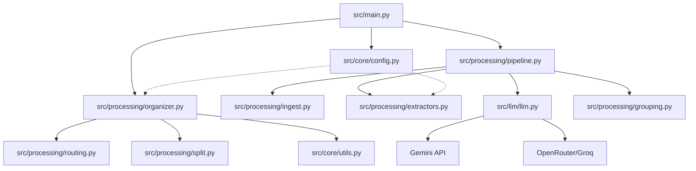

<!-- generated-by: gsd-doc-writer -->
# Architecture

## System Overview
The File Categorizer is a general-purpose, configuration-driven document processing system. It transforms monolithic PDFs into structured filesystems. Driven by a user-provided YAML/JSON configuration file, the system employs a multi-pass pipeline that uses local OCR/Vision extraction combined with LLM-based semantic analysis for customized AI extraction, cleaning, grouping, and folder organization.

## Component Diagram

## Data Flow
1. **Ingestion**: `PdfIngestor` converts PDF pages into images.
2. **Pass 1 (Config-Driven Extraction)**: `VisionExtractor` and `CloudExtractor` use LLMs to extract metadata based on the custom fields and prompt instructions provided in the user's config file.
3. **Pass 1.5 (Audit & Cleaning)**: 
    - The system runs cleaning strategies (e.g. date cleaning, alias mapping) configured via the `cleaning` section in the config file.
4. **Pass 2 (Dynamic Grouping)**: Pages are grouped into `DocumentGroup` objects according to the `grouping` strategy specified in the config. Boundary detection employs adaptive chunk shrinking to handle large documents or repeated LLM server errors.
5. **Organization & Routing**: `FileOrganizer` creates a folder hierarchy and splits the PDF based on the `routing.destination_format` defined by the user (e.g., `{primary_tenant}/{category}`). Every major routing and tenant resolution decision is captured as a structured audit trace.

## Key Abstractions
- `Pipeline` (`src/processing/pipeline.py`): The main orchestrator managing the multi-pass logic.
- `LLMClient` (`src/llm/llm.py` and `src/llm_client.py`): A provider-agnostic interface for AI models. It supports structured output via Pydantic schemas and implements a specialized boundary-call circuit breaker (`LLMChunkShrinkRequiredError`) that signals the pipeline to shrink prompt sizes upon repeated server errors.
- `FileOrganizer` (`src/processing/organizer.py`): Translates `DocumentGroup` objects into a physical directory structure governed by the user's config rules. It includes enhanced logic for resolving 'Unassigned' tenants using inferred YYYY-MM date periods.
- `Decision Traces` (`src/logger.py`): A utility (`log_decision_trace`) that writes structured JSON logs for every major pipeline decision (grouping, routing, tenant resolution), ensuring a transparent and auditable AI workflow.
- `AppConfig` and User Config (`src/core/config.py`): Manages environment variables and custom user YAML definitions.
- `sanitize_filename` (`src/core/utils.py`): A centralized utility that ensures filesystem safety by removing illegal characters and truncating long filenames while explicitly preserving the file extension.

## Directory Structure Rationale
- `src/`: Contains all application logic.
    - `core/`: Core utilities (`utils.py`), configurations (`config.py`), and schemas (`schemas.py`).
    - `llm/`: Infrastructure layer for AI integration (`llm.py`, `providers.py`).
    - `processing/`: Core business logic including orchestration (`pipeline.py`), grouping (`grouping.py`), routing (`routing.py`), extraction (`extractors.py`), and file organization (`organizer.py`).
    - `logger.py` & `main.py`: Logging utilities and the application entry point.
- `tests/`: Comprehensive test suite covering pipeline and organizer logic.
- `scripts/`: Custom grouping and routing python scripts (if using python strategy).
- `.tracking/`: Local storage for API quota tracking.
- `logs/`: Application execution logs.
