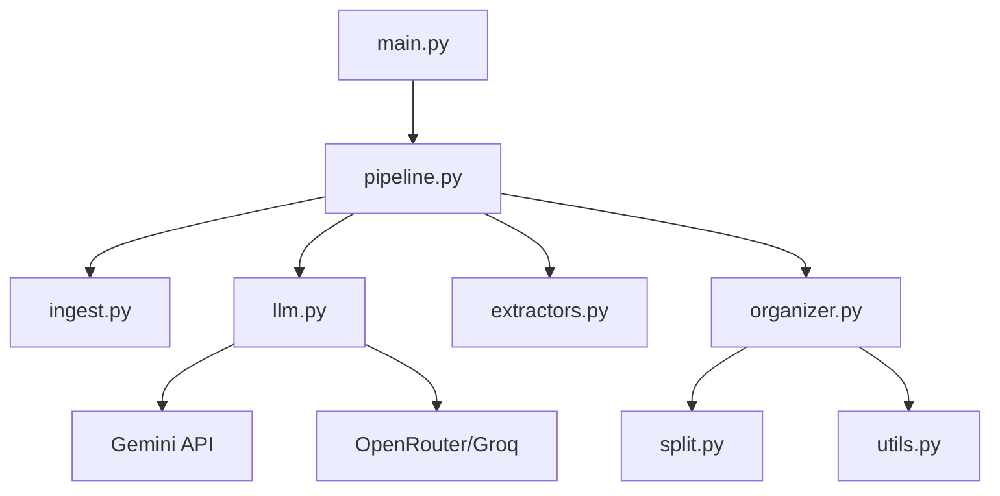

<!-- generated-by: gsd-doc-writer -->
# Architecture

## System Overview
The File Categorizer is a document processing system that transforms a monolithic PDF of housing records into a structured filesystem. It employs a multi-pass pipeline that combines local OCR/Vision extraction with LLM-based semantic analysis to solve the "noisy data" problem (missing dates, name aliases, and mixed-tenant files).

## Component Diagram

## Data Flow
1. **Ingestion**: `PdfIngestor` converts PDF pages into images.
2. **Pass 1 (Vision Extraction)**: `VisionExtractor` and `CloudExtractor` use LLMs to extract `Category`, `Residents`, and `Date` for every page.
3. **Pass 1.5 (Audit & Interpolation)**: 
    - **Date Cleaning**: LLMs detect date outliers; the system interpolates missing dates based on surrounding pages.
    - **Alias Mapping**: LLMs cluster different spellings of the same resident name into a canonical identity.
    - **Timeline Overwrite**: Primary tenants are identified based on "anchor" documents; residency timelines are calculated to overwrite noisy labels on intermediate pages.
4. **Pass 2 (Tenant Grouping)**: Pages are grouped into `DocumentGroup` objects using semantic boundaries and resident identity.
5. **Organization**: `FileOrganizer` creates a folder hierarchy (`House` -> `Resident` -> `Category`) and splits the original PDF into segments.

## Key Abstractions
- `Pipeline` (`src/pipeline.py`): The main orchestrator managing the multi-pass logic.
- `LLMClient` (`src/llm.py`): A provider-agnostic interface for Gemini, OpenRouter, and Groq with built-in rate limiting and failover.
- `FileOrganizer` (`src/organizer.py`): Translates logical `DocumentGroup` objects into a physical directory structure.
- `PageClassification` (`src/schemas.py`): A Pydantic schema ensuring type-safe extraction of page metadata.

## Directory Structure Rationale
- `src/`: Contains all application logic.
    - `pipeline.py` & `organizer.py`: Core business logic.
    - `llm.py` & `providers.py`: Infrastructure layer for AI integration.
    - `extractors.py` & `split.py`: Low-level PDF manipulation.
    - `config.py` & `schemas.py`: Cross-cutting concerns (settings and types).
- `tests/`: Comprehensive test suite covering pipeline and organizer logic.
- `.tracking/`: Local storage for API quota tracking.
- `logs/`: Application execution logs.
