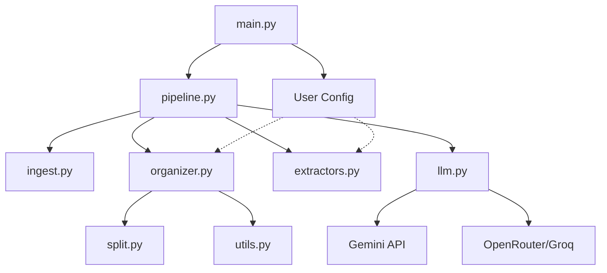

<!-- generated-by: gsd-doc-writer -->
# Architecture

## System Overview
The File Categorizer is a general-purpose, configuration-driven document processing system. It transforms monolithic PDFs into structured filesystems. Driven by a user-provided YAML/JSON configuration file, the system employs a multi-pass pipeline that uses local OCR/Vision extraction combined with LLM-based semantic analysis for customized AI extraction, cleaning, grouping, and folder organization.

## Component Diagram

## Data Flow
1. **Ingestion**: `PdfIngestor` converts PDF pages into images.
2. **Pass 1 (Config-Driven Extraction)**: `VisionExtractor` and `CloudExtractor` use LLMs to extract metadata based on the custom fields and prompt instructions provided in the user's config file.
3. **Pass 1.5 (Audit & Cleaning)**: 
    - The system runs cleaning strategies (e.g. date cleaning, alias mapping) configured via the `cleaning` section in the config file.
4. **Pass 2 (Dynamic Grouping)**: Pages are grouped into `DocumentGroup` objects according to the `grouping` strategy specified in the config.
5. **Organization & Routing**: `FileOrganizer` creates a folder hierarchy and splits the PDF based on the `routing.destination_format` defined by the user (e.g., `{primary_tenant}/{category}`).

## Key Abstractions
- `Pipeline` (`src/pipeline.py`): The main orchestrator managing the multi-pass logic.
- `LLMClient` (`src/llm.py`): A provider-agnostic interface for AI models with built-in failover.
- `FileOrganizer` (`src/organizer.py`): Translates `DocumentGroup` objects into a physical directory structure governed by the user's config rules.
- `AppConfig` and User Config (`src/config.py`): Manages environment variables and custom user YAML definitions.

## Directory Structure Rationale
- `src/`: Contains all application logic.
    - `pipeline.py` & `organizer.py`: Core business logic.
    - `llm.py` & `providers.py`: Infrastructure layer for AI integration.
    - `extractors.py` & `split.py`: Low-level PDF manipulation based on config instructions.
    - `config.py` & `schemas.py`: Configuration and types.
- `tests/`: Comprehensive test suite covering pipeline and organizer logic.
- `scripts/`: Custom grouping and routing python scripts (if using python strategy).
- `.tracking/`: Local storage for API quota tracking.
- `logs/`: Application execution logs.
